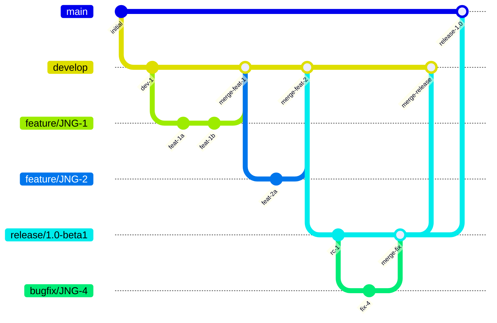
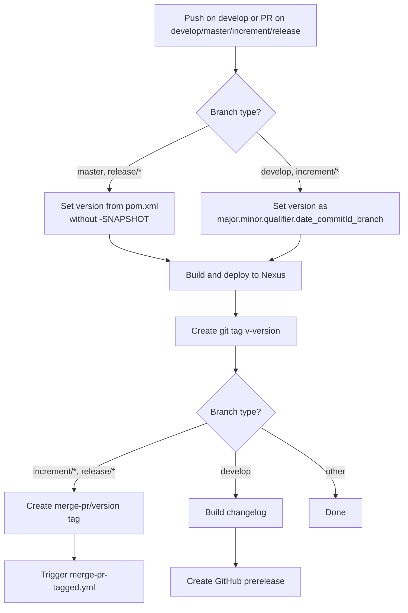
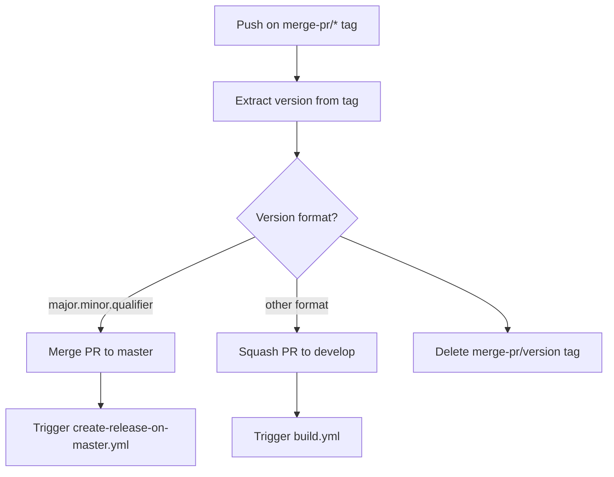
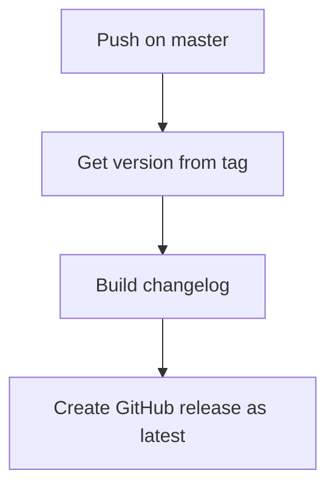
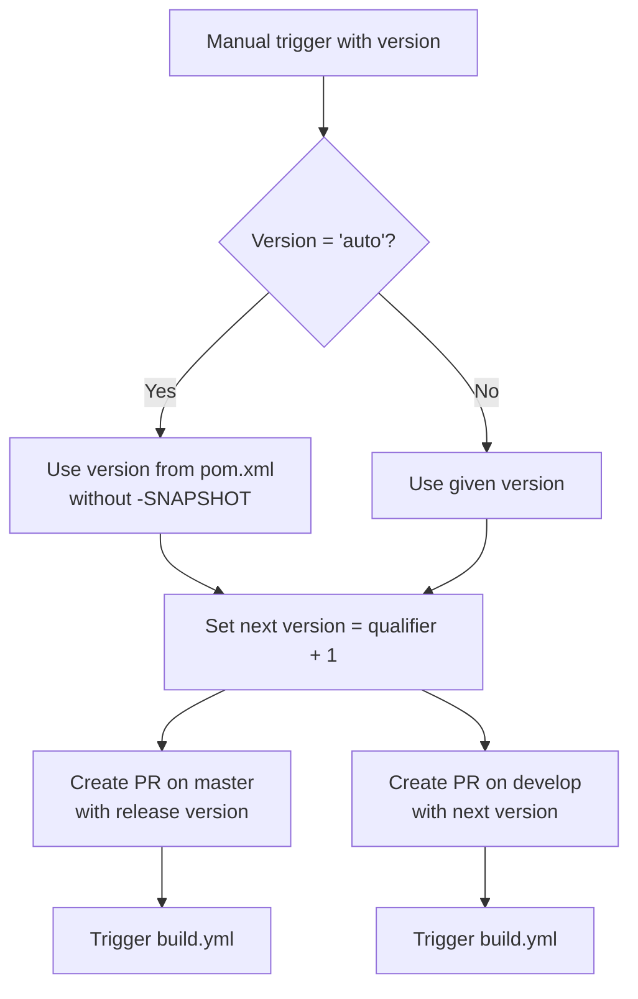

# Development Version and Branch Handling

This document describes the GitFlow-based branching strategy and CI/CD pipeline used by flutter-maven-plugin. All version management and automated workflows follow these conventions.

## Branches

The branching model is based on [GitFlow](https://www.atlassian.com/git/tutorials/comparing-workflows/gitflow-workflow). Each branch type has a specific role in the development lifecycle:

| Branch Pattern | Base | Purpose |
|----------------|------|---------|
| `develop` | — | Main development branch containing latest sources of the active version |
| `feature/JNG-NUMBER_summary` | `develop` | New features for the next release |
| `release/X.Y-betaN` | `develop` | Release candidates; the `release/` prefix is reserved for CI |
| `bugfix/JNG-NUMBER_summary` | `release/*` | Bug fixes on release branches; must also be applied to newer release and develop branches |
| `support/JNG-NUMBER_summary` | `release/*` | Support for previous releases with minor changes; merged back to the release branch |
| `master` | — | Contains the latest released sources |
| `hotfix/JNG-NUMBER_summary` | `master` | Critical fixes applied to both release and master branches |

## Version Numbers

Version numbers follow semantic versioning with these rules:

| Event | Version Change |
|-------|---------------|
| Start a `feature/` branch | No change |
| Start a `release/` branch | 2nd number increases on `develop` |
| Start a `bugfix/` branch | No change (applied on release branches before merge to master) |
| Start a `support/` branch | 3rd number increases |
| Start a `hotfix/` branch | 4th number increases |

## GitHub Actions Workflows

The CI/CD pipeline is composed of four interconnected workflows that automate building, testing, versioning, merging, and releasing.

### build.yml — Main Build Pipeline

This workflow triggers on pushes to `develop` and pull requests targeting `develop`, `master`, `increment/*`, or `release/*` branches.

### merge-pr-tagged.yml — Pull Request Merge Automation

Triggered when a `merge-pr/*` tag is pushed. Handles automatic merging of pull requests based on version format.

### create-release-on-master.yml — Release Creation

Triggered by pushes to `master`. Creates the official GitHub release with a changelog.

### release.yml — Release Initiation

Manually triggered with a version parameter. Creates the pull requests that start the release process.

## How to Develop

Issue tracking uses [JIRA](https://blackbelt.atlassian.net/jira/dashboards).

> **Important:** There is no commit without a ticket number. Every pull request and commit must reference a `JNG-xxx` ticket.
