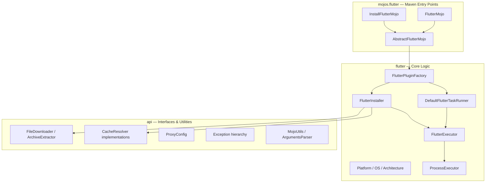

# Contributing to flutter-maven-plugin

## Development Environment

### Required Tools

| Tool | Version | Download |
|------|---------|----------|
| **Java JDK** | 21+ | [Azul Zulu JDK](https://www.azul.com/downloads/?version=java-21-lts&package=jdk) |
| **Maven** | 3.9.4+ | [Apache Maven](https://maven.apache.org/download.cgi) or use the included `./mvnw` wrapper |

### Verifying Your Setup

Check Java:

```bash
java -version
# Should show: openjdk version "21.x.x" ...
```

Check Maven:

```bash
mvn -version
# Should show: Apache Maven 3.9.x ...
```

## Code Structure

This project follows a standard Maven project layout for a single-module Maven plugin.



## Build Commands

```bash
# Run tests
mvn clean test

# Full build (compile, test, package, install to local repo)
mvn clean install

# Build without tests
mvn clean install -DskipTests

# Run with debug output
mvn -X clean test
```

## Submitting an Issue

Before submitting a new issue, search the [issue tracker](https://github.com/BlackBeltTechnology/flutter-maven-plugin/issues) first — the problem may already be reported or resolved.

When filing an issue, include:

- Output of `java -version` and `mvn -version`
- Your `pom.xml` configuration (or `.flattened-pom.xml` if applicable)
- A minimal reproduction case that demonstrates the failure

A minimal reproduction helps us confirm bugs quickly and ensures we're fixing the right problem.

[File a new issue](https://github.com/BlackBeltTechnology/flutter-maven-plugin/issues/new/choose)

## Submitting a Pull Request

This project follows [GitHub's standard forking model](https://guides.github.com/activities/forking/). Fork the repository, make your changes, and submit a pull request.

For details about the CI/CD pipeline and branching strategy, see the [CI Flow documentation](.github/CIFLOW.md).
