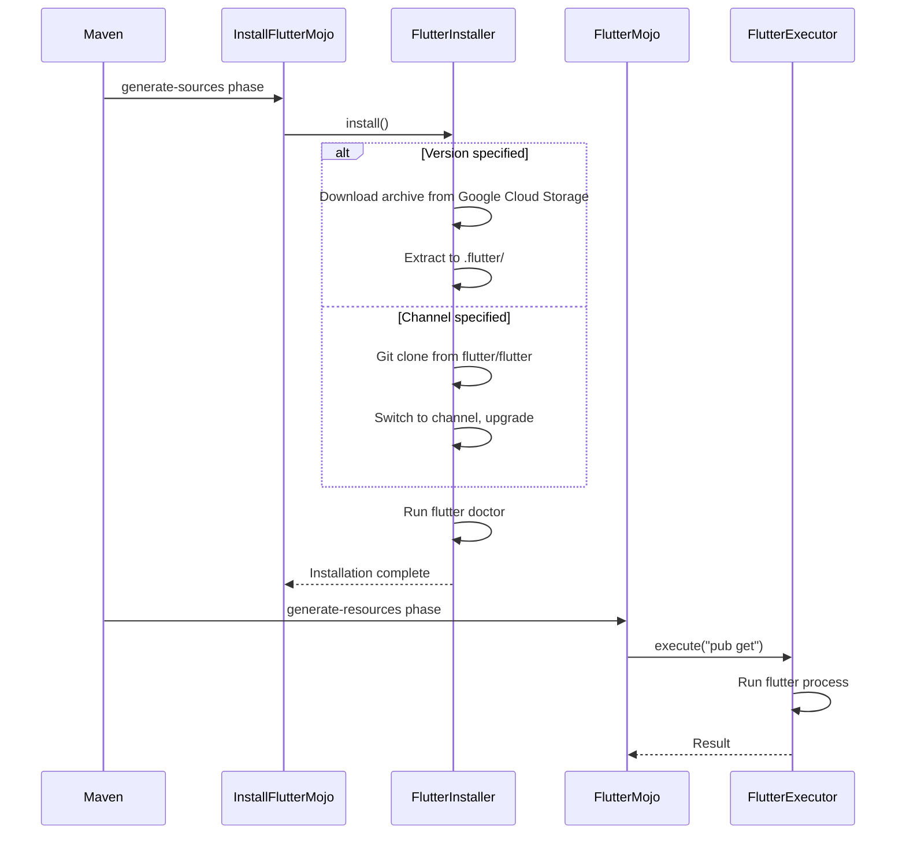
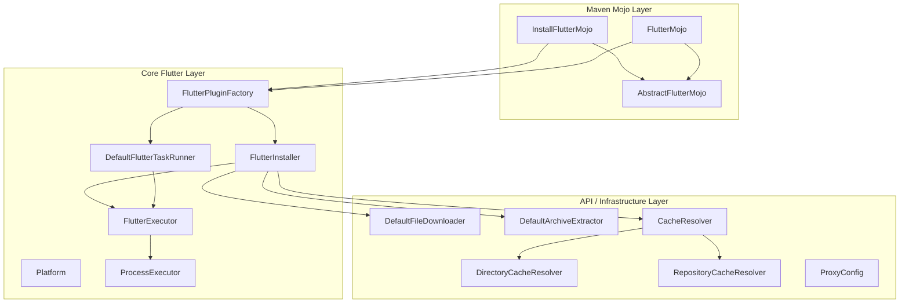

# Flutter Maven Plugin

This plugin manages and executes [Flutter](https://flutter.dev/) commands inside Maven projects. It handles Flutter installation automatically — no pre-installed Flutter is required. Flutter is installed **locally** to your project and will not interfere with any existing global installations.

The plugin supports two installation methods: downloading a specific Flutter version as a binary archive, or cloning from Git using a channel (stable, beta, dev). It works across Windows, macOS, and Linux, automatically detecting the platform and choosing the appropriate archive format and binary.

## Requirements

- **Java:** 21+
- **Maven:** 3.9.4+

## Installation

Include the plugin in your Maven project's `pom.xml`. Replace `LATEST_VERSION` with the [latest release version](https://repo1.maven.org/maven2/hu/blackbelt/flutter-maven-plugin/).

```xml
<plugins>
    <plugin>
        <groupId>hu.blackbelt</groupId>
        <artifactId>flutter-maven-plugin</artifactId>
        <version>LATEST_VERSION</version>
        ...
    </plugin>
</plugins>
```

## How It Works



## Usage

### Installing Flutter

The `install-flutter` goal downloads Flutter from [Google Cloud Storage](https://storage.googleapis.com/flutter_infra/releases/) or clones it from [Git](https://github.com/flutter/flutter.git), placing it into a `.flutter` folder in your installation directory.

```xml
<execution>
    <id>install-flutter</id>
    <phase>generate-sources</phase>
    <goals>
        <goal>install-flutter</goal>
    </goals>
    <configuration>
        <flutterVersion>1.23</flutterVersion>
        <flutterChannel>stable</flutterChannel>
        <workingDirectory>${basedir}</workingDirectory>
        <flutterDownloadRoot>https://storage.googleapis.com/flutter_infra/releases/</flutterDownloadRoot>
        <flutterGitUrl>https://github.com/flutter/flutter.git</flutterGitUrl>
        <skip>false</skip>
        <installDirectory>${basedir}/.flutter</installDirectory>
        <tempDirectory>${basedir}/target/temp</tempDirectory>
        <environmentVariables>
            <TEST_VAR>${project.build.directory}</TEST_VAR>
        </environmentVariables>
    </configuration>
</execution>
```

Can also be run from the command line:

```bash
mvn flutter:install-flutter -Dflutter-channel="beta"
```

All parameters are optional.

#### Install Parameters

| Parameter | CLI Property | Default | Description |
|-----------|-------------|---------|-------------|
| `flutterVersion` | `-Dflutter-version` | *(none)* | Specific Flutter version to install. When set, the binary archive download is used instead of Git. |
| `flutterChannel` | `-Dflutter-channel` | `stable` | Flutter channel to use (`stable`, `beta`, `dev`). Used with Git-based installation when no version is specified. |
| `workingDirectory` | `-Dflutter-working-directory` | `${basedir}` | Base directory for running Flutter commands (usually contains `pubspec.yaml`). |
| `flutterDownloadRoot` | `-Dflutter-download-root` | `https://storage.googleapis.com/flutter_infra/releases/` | Base URL for Flutter binary downloads. |
| `flutterGitUrl` | `-Dflutter-git-url` | `https://github.com/flutter/flutter.git` | Flutter Git repository URL. |
| `skip` | `-Dflutter-install-skip=true` | `false` | Skip the installation step. |
| `installDirectory` | `-Dflutter-install-directory` | `${basedir}/.flutter` | Where Flutter will be installed. |
| `tempDirectory` | `-Dflutter-temp-directory` | `${basedir}/target/temp` | Temporary directory used during archive extraction. |
| `environmentVariables` | — | *(none)* | Extra environment variables passed to Flutter commands. |

### Running Flutter Commands

The `flutter` goal executes Flutter commands in your project directory.

```xml
<execution>
    <id>flutter</id>
    <phase>compile</phase>
    <goals>
        <goal>flutter</goal>
    </goals>
    <configuration>
        <arguments>pub get</arguments>
        <workingDirectory>${basedir}</workingDirectory>
        <skip>false</skip>
        <installDirectory>${basedir}/.flutter</installDirectory>
        <environmentVariables>
            <TEST_VAR>${project.build.directory}</TEST_VAR>
        </environmentVariables>
        <parallel>false</parallel>
    </configuration>
</execution>
```

Command line usage:

```bash
mvn flutter:flutter -Dflutter-arguments="doctor"
```

#### Flutter Parameters

| Parameter | CLI Property | Default | Description |
|-----------|-------------|---------|-------------|
| `arguments` | `-Dflutter-arguments` | `pub get` | Arguments passed to the Flutter CLI. |
| `workingDirectory` | `-Dflutter-working-directory` | `${basedir}` | Base directory for running Flutter commands. |
| `skip` | `-Dflutter-skip=true` | `false` | Skip execution. |
| `installDirectory` | `-Dflutter-install-directory` | `${basedir}/.flutter` | Flutter installation directory. |
| `environmentVariables` | — | *(none)* | Extra environment variables passed to Flutter. |
| `parallel` | `-Dflutter-parallel=false` | `false` | Enable parallel execution. |

> **Note:** Maven supports parallel builds with the `-T` option. By default, plugin execution is **synchronized** to prevent conflicts when multiple Flutter projects run commands like `pub get` simultaneously. Set `parallel=true` only for project-specific steps that are safe to run concurrently (e.g., compile, build runner).

### Full Example

This example installs Flutter from the beta channel, enables web support, runs `pub get`, and launches in Chrome:

```xml
<project xmlns="http://maven.apache.org/POM/4.0.0"
         xmlns:xsi="http://www.w3.org/2001/XMLSchema-instance"
         xsi:schemaLocation="http://maven.apache.org/POM/4.0.0 http://maven.apache.org/xsd/maven-4.0.0.xsd">
    <modelVersion>4.0.0</modelVersion>
    <groupId>hu.blackbelt</groupId>
    <version>LATEST_VERSION</version>
    <artifactId>flutter-maven-plugin-test</artifactId>

    <build>
        <plugins>
            <plugin>
                <groupId>hu.blackbelt</groupId>
                <artifactId>flutter-maven-plugin</artifactId>
                <version>1.0.0-SNAPSHOT</version>
                <executions>
                    <execution>
                        <id>install-flutter</id>
                        <phase>generate-sources</phase>
                        <goals>
                            <goal>install-flutter</goal>
                        </goals>
                        <configuration>
                            <flutterChannel>beta</flutterChannel>
                        </configuration>
                    </execution>

                    <execution>
                        <id>flutter-config-enable-web</id>
                        <phase>compile</phase>
                        <goals><goal>flutter</goal></goals>
                        <configuration>
                            <arguments>config --enable-web</arguments>
                            <parallel>false</parallel>
                        </configuration>
                    </execution>

                    <execution>
                        <id>flutter-pub-get</id>
                        <phase>compile</phase>
                        <goals><goal>flutter</goal></goals>
                        <configuration>
                            <parallel>false</parallel>
                        </configuration>
                    </execution>

                    <execution>
                        <id>run-chrome-get</id>
                        <phase>compile</phase>
                        <goals><goal>flutter</goal></goals>
                        <configuration>
                            <arguments>run -d chrome</arguments>
                        </configuration>
                    </execution>
                </executions>
            </plugin>
        </plugins>
    </build>
</project>
```

## Architecture

The plugin is organized into three layers:



## Proxy Settings

If you have configured proxy settings for Maven in your `settings.xml`, the plugin automatically uses the proxy for downloading Flutter and passes proxy configuration to Flutter commands. The plugin supports:

- HTTP and HTTPS proxies
- Proxy authentication (username/password)
- Non-proxy host patterns with wildcard matching

## Building the Plugin

```bash
mvn clean install
```

## Issues & Contributing

- **Issues:** [GitHub Issue Tracker](https://github.com/BlackBeltTechnology/flutter-maven-plugin/issues)
- **Pull Requests:** [GitHub Pull Requests](https://github.com/BlackBeltTechnology/flutter-maven-plugin/pulls)
- **Contributors:** [Full list](https://github.com/BlackBeltTechnology/flutter-maven-plugin/graphs/contributors)

## Credit

This project is heavily inspired by [frontend-maven-plugin](https://github.com/eirslett/frontend-maven-plugin).

## License

[Apache License 2.0](LICENSE)
